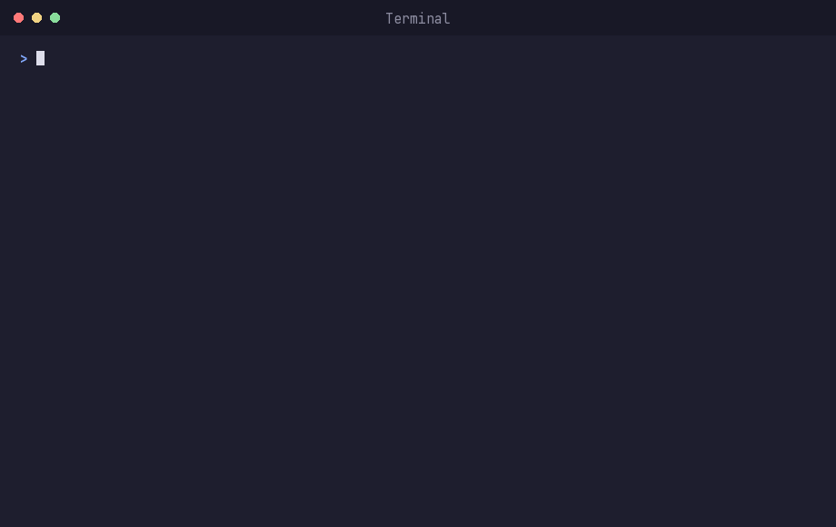
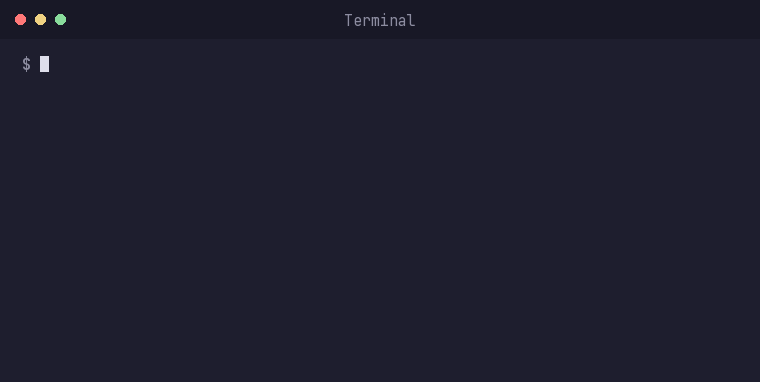

# arge-tesvik-skills

Türkiye'deki Ar-Ge teşvik süreçlerini (TÜBİTAK TEYDEB/ARDEB, patent, 5746 mevzuatı) yürüten bir **Ar-Ge Teşvik & Proje Uzmanı**'nın işini destekleyen bir Claude Code eklentisi (`arge-tesvik`).

Bu araç TÜBİTAK ile ilişkili değildir. Resmi kaynak: [tubitak.gov.tr](https://www.tubitak.gov.tr)

## Ne işe yarar

Eklenti altı skill ve beş slash komutu içerir:

| Skill | Ne yapar |
|---|---|
| `hakem-simulasyonu` | Bir TÜBİTAK proje önerisi taslağını panel hakemi gözüyle **eleştirir** (içerik üretmez). Endüstriyel Ar-Ge niteliği/yenilik, proje planı/yapılabilirlik ve — en ağırlıklı boyut olarak — ticarileşme potansiyeli üzerinden somut, gerekçeli zayıf noktalar ve düzeltme yönleri verir. Asla puan uydurmaz, asla kabul garantisi vermez. |
| `gider-kalemi-kontrolu` | TEYDEB bütçe kalemlerini 5 resmi gider kategorisine (personel, seyahat, hizmet alımı, alet/teçhizat/yazılım/yayın alımı, malzeme/sarf) oturtur ve hakem raporlarında sık görülen ret kalıplarına (uygun olmayan personel ödemeleri, business class seyahat, "altyapı yatırımı" görünümlü alımlar, gerekçesiz dış hizmet alımı vb.) göre işaretler. Bütçe üst limitlerini hafızadan yazmaz. |
| `cagri-tarama` | Açık TÜBİTAK çağrılarını (1501, 1505, 1507, 1509, 1511, 1707, ARDEB 1001/3001) web'den tarar, son başvuru tarihine göre sıralı bir tablo üretir. Bütçe üst limiti gibi sayısal değerleri hafızadan yazmaz, her zaman kaynaktan çeker ve kaynağı belirtir. |
| `patent-on-arastirma` | `markapatent-mcp` sunucusu üzerinden TÜRKPATENT'te patent/marka/tasarım ön araştırması yapar, benzer başvuruları listeler. Sadece bulguları sunar — "bu fikir özgündür" gibi bir sonuca asla varmaz, karar insana aittir. |
| `donem-raporu-kontrolu` | Kabul edilmiş bir projenin dönemsel Gelişme Raporu'nu (AGY301) veya proje sonu Sonuç Raporu'nu, TEYDEB'e sunulmadan önce izleyici/hakem gözüyle **eleştirir**. Onaylı proje planıyla karşılaştırıp somut kanıt eksikliğini, gerekçesiz takvim/bütçe sapmalarını ve tutarsız bir sonraki dönem planını işaretler. Kesinti/red öngörmez, kanıt uydurmaz. |
| `itiraz-hazirlik` | Proje reddedildiğinde **itiraz mı yoksa revizyon + yeniden başvuru mu** uygun olduğuna karar vermeye yardımcı olur. İtiraz yolu seçilirse TÜBİMER dilekçesini SADECE mevcut proje metni/hakem raporuna dayanarak, izin verilen 4 gerekçe kategorisinden birine oturtarak hazırlar (yeni teknik iddia eklemez — bu itirazı geçersiz kılar) ve 15 günlük itiraz süresini hatırlatır. |

Slash komutları ilgili skill'i doğrudan tetikler:

- `/arge-tesvik:degerlendir` → `hakem-simulasyonu`
- `/arge-tesvik:gider` → `gider-kalemi-kontrolu`
- `/arge-tesvik:tara` → `cagri-tarama`
- `/arge-tesvik:rapor` → `donem-raporu-kontrolu`
- `/arge-tesvik:itiraz` → `itiraz-hazirlik`

(Claude Code'da plugin komutları `<plugin-adı>:<komut-adı>` şeklinde adlandırılır; bu eklentinin adı `arge-tesvik` olduğu için tam komut isimleri yukarıdaki gibidir. Kısaca `/degerlendir` ve `/tara` yazmak da, başka bir eklentiyle çakışmadığı sürece çalışır.)

## Kurulum

Bu depo hem plugin'i (`.claude-plugin/plugin.json`) hem de kendi kendini listeleyen bir marketplace'i (`.claude-plugin/marketplace.json`) içerir, bu yüzden ek bir marketplace deposuna ihtiyaç yoktur.

Claude Code kurulu olan normal bir terminalde şu iki komutu çalıştırın:

```
claude plugin marketplace add ibrahim-isikli/arge-tesvik-skills
claude plugin install arge-tesvik@arge-tesvik-skills
```

Bundan sonra `claude` yazıp yeni bir oturum açtığınızda eklenti hazır olur — ayrıca bir "reload" adımına gerek yoktur, çünkü her yeni `claude` oturumu kurulu plugin'leri zaten yükler. Deneme için: `/arge-tesvik:degerlendir` yazın ya da bir taslak paylaşıp "hakem ne der?" deyin.

Adımların terminalde tam olarak nasıl göründüğü (bu komutları bu depoya karşı gerçekten çalıştırıp çıktısını kaydettim, uydurma metin değil):


Zaten açık bir Claude Code oturumundaysanız aynı işlemi oturumun kendi komut satırına `/plugin marketplace add ...` ve `/plugin install ...` yazarak da yapabilirsiniz; bu durumda kurulum özeti "Run /reload-plugins to activate." derse `/reload-plugins` çalıştırmanız gerekir (bu ekran etkileşimli bir seçim adımı içerdiği için burada ayrıca göstermedim).

Yerelde geliştirirken/denerken (marketplace/install adımları olmadan, doğrudan klasörden):

```
claude --plugin-dir /path/to/arge-tesvik-skills
```

## Kullanım örneği

### hakem-simulasyonu

Kurulumdan sonra herhangi bir slash komutu yazmanıza da gerek yok — bir proje önerisi taslağı paylaşıp "hakem ne der?" demeniz `hakem-simulasyonu` skill'ini tetiklemeye yeter. Aşağıda gerçek bir taslakla yaptığım gerçek bir koşunun çıktısının ilk kısmı var (raporun tamamı üç boyutu, düzeltme önerilerini ve ÜYZ/beyan hatırlatmalarını da içerecek şekilde devam eder — GIF'te yer sınırlı olduğu için "..." ile kestim):


### cagri-tarama

Aynı şekilde, "TÜBİTAK'ın açık çağrıları neler, 1501 ve 1507'nin son başvuru tarihi ne zaman?" demeniz yeterli. Aşağıdaki GIF de gerçek bir koşudan alındı — tarihler, durumlar ve kaynaklar gerçek arama sonucundan birebir; sadece dar terminal genişliğine sığması için tablo yerine liste düzeninde gösterdim ve tam tabloyu (1001, 1505, 1707, 1511, 3001 dahil) "..." ile kestim:



**Önemli:** GIF'teki tarihler 6 Ağustos 2026'da yapılan gerçek bir taramanın sonucu — canlı/güncel değil, örnek olsun diye burada donmuş durumda. Skill her çalıştığında yeniden tarama yapar; kendi sorgunuzda güncel tarihleri göreceksiniz.

## markapatent-mcp bağlantısı

`patent-on-arastirma` skill'i, `plugin.json` içinde tanımlı uzak bir HTTP MCP sunucusuna (`https://markapatent-mcp.fastmcp.app/mcp`) bağımlıdır. Plugin etkinleştirildiğinde bu sunucu otomatik başlatılır/bağlanır; ilk kullanımda Claude Code sizden onay isteyebilir. Sunucunun kendisi bu eklentinin bir parçası değildir — TÜRKPATENT verisine erişimi markapatent tarafı sağlar.

## references/ klasörü

`references/` klasörü kasıtlı olarak boş gelir. TÜBİTAK'ın uygulama esasları, AGY101/AGY301 şablonları ve güncel çağrı metinleri gibi belgeler sık güncellendiği ve bu depoda yeniden dağıtılması uygun olmadığı için, bu belgeleri tubitak.gov.tr'den indirip kendiniz eklemeniz gerekir. Hangi dosyaların nereden indirileceği için `references/README.md`'ye bakın.

İndirdiğiniz dosyaları klasöre taşımak, herhangi bir dosya yöneticisiyle ya da terminalde `mv`/sürükle-bırak ile yapılan sıradan bir işlemdir — örnek:



## Otomatik çağrı takibi (opsiyonel)

`cagri-tarama` her çalıştığında canlı tarama yapar, ama isterseniz Claude Code'un Routine (zamanlanmış tetikleyici) özelliğiyle bunu periyodik hale getirebilirsiniz — örneğin her Pazartesi `/arge-tesvik:tara` çalıştırıp yeni çağrı veya yaklaşan son başvuru tarihi varsa size haber vermesini isteyebilirsiniz. Bu, depoya gömülü bir özellik değil, Claude Code'un genel zamanlama mekanizmasının bu eklentiyle kullanımıdır; kurmak isterseniz Claude'a "her Pazartesi /arge-tesvik:tara çalıştır ve yeni çağrı varsa bana haber ver" demeniz yeterli.

## Sürüm geçmişi

Değişiklikler için [CHANGELOG.md](./CHANGELOG.md)'ye bakın.

## Zorunlu kurallar (tüm skill'lerde geçerli)

Her skill, TÜBİTAK ÜYZ (üretken yapay zeka) Rehberi (Eylül 2025) kapsamında şu kurallara uyacak şekilde yazıldı:

- **Gizlilik**: Ciro, bütçe detayı, yayınlanmamış teknik bilgi gibi hassas/gizli firma verileri araca girilmemeli; skill'ler kullanıcıyı bu konuda uyarır ve placeholder mantığıyla çalışır.
- **Beyan zorunluluğu**: Proje önerisi hazırlanırken bir ÜYZ aracından önemli ölçüde faydalanıldıysa, bunun başvuruda beyan edilmesi gerektiğini her skill çıktısının sonunda hatırlatır.
- **Nihai sorumluluk**: Başvurunun içeriğinden ve doğruluğundan nihai olarak başvuru sahibi sorumludur; hiçbir skill bu sorumluluğu üstlenmez.
